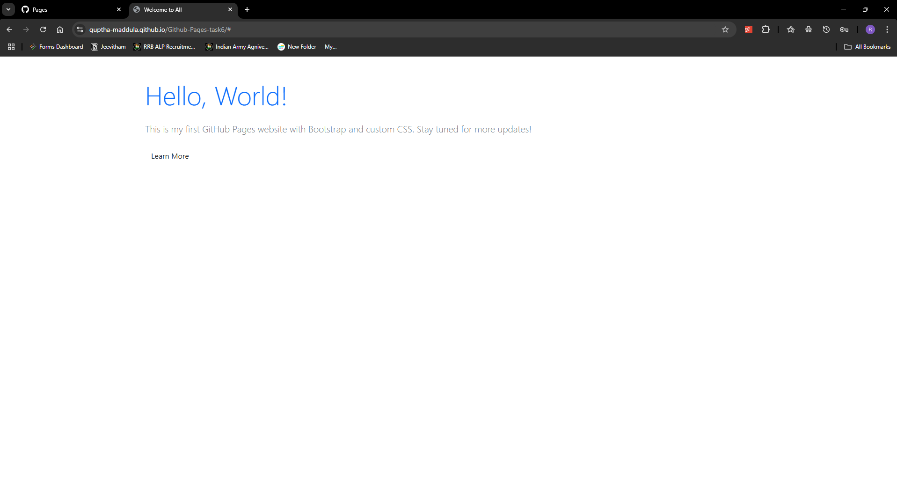

# Hosting a simple Web page by Github-pages


This project showcases a fully functional static website created using **HTML** for structure, **CSS** for styling, and **Bootstrap** for responsive design. The site is deployed effortlessly via **GitHub Pages**, a reliable and free hosting service.  

It provides a minimalistic yet elegant design, ensuring a seamless user experience across devices of all screen sizes. Through the use of Bootstrap, the website achieves modern layouts and responsive components, while custom CSS adds a unique, personalized touch to its appearance.  

##  Hosting the Website  
Visit the site here: [GitHub Pages Task 6](https://guptha-maddula.github.io/Github-Pages-task6/)  



##  Features  
- **Fully Responsive:** Thanks to Bootstrap integration.  
- **Custom Styling:** CSS for unique design tweaks.  
- **Deployed on GitHub Pages:** Easy access and free hosting.  

##  How to Set Up Locally  
1. Clone the repository:  
   ```bash
   git clone https://github.com/guptha-maddula/Github-Pages-task6.git
   ```
2. Navigate into the project folder:  
   ```bash
   cd Github-Pages-task6
   ```
3. Open `index.html` in a browser to view the website locally.

##  Deployment on GitHub Pages  
1. Push all necessary files (`index.html`, `style.css`, etc.) to GitHub.  
2. Go to **Settings** → **Pages**.  
3. Select `main` as the branch, set the folder source, and enable GitHub Pages.  
4. Your site will be available at the generated GitHub Pages link.

# Conclusion
The repository not only demonstrates essential web development skills but also highlights the simplicity of hosting and maintaining static websites with GitHub Pages. It’s perfect for anyone looking to learn, explore, or build on their own web development journey.  

---